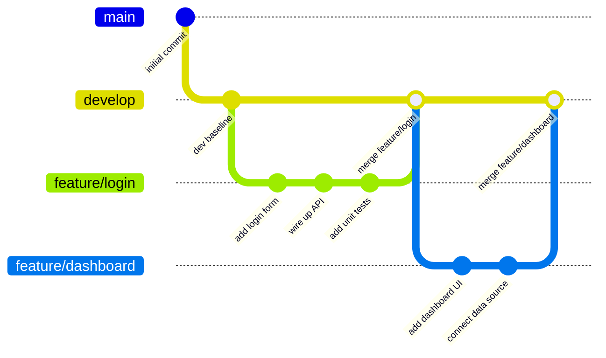
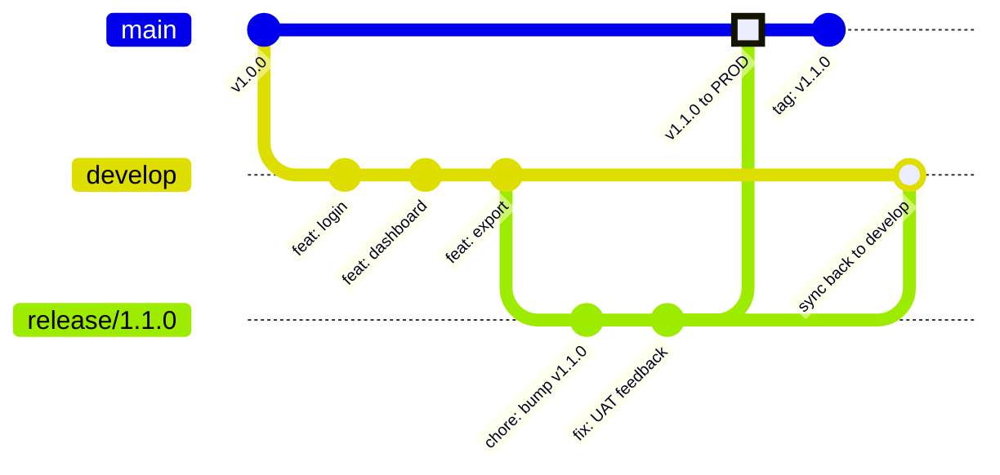
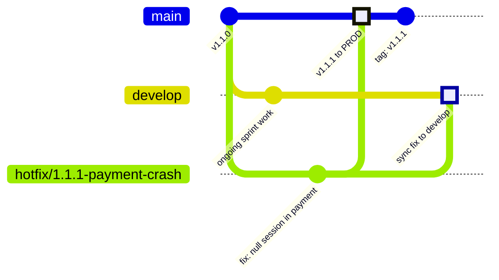

# branching-strategy

> A hybrid **Git Flow + Environment Branching** strategy with two deployment environments: **UAT** and **Production**.

---

## Table of Contents

1. [Branch Structure](#1-branch-structure)
2. [Environment Map](#2-environment-map)
3. [Flow Diagrams](#3-flow-diagrams)
   - [Feature Flow](#31-feature-flow)
   - [Release + UAT Flow](#32-release--uat-flow)
   - [Hotfix Flow](#33-hotfix-flow)
4. [Step-by-Step Workflows](#4-step-by-step-workflows)
   - [Feature Development](#41-feature-development)
   - [Release & UAT Gate](#42-release--uat-gate)
   - [Hotfix](#43-hotfix)
5. [Rollback Procedures](#5-rollback-procedures)
6. [CI/CD Pipeline Overview](#6-cicd-pipeline-overview)
7. [Repository Setup Checklist](#7-repository-setup-checklist)

---

## 1. Branch Structure

| Branch | Purpose | Deploys to | Protected |
|---|---|---|---|
| `main` | Production-ready code. Always stable. | **Production** | ✅ Yes |
| `uat` | UAT environment. Stakeholder testing only. | **UAT** | ✅ Yes |
| `release/*` | Release candidates. Version bumps + bug fixes only. | UAT (auto on push) | ✅ Yes |
| `develop` | Integration branch. All features land here first. | — | ✅ Yes |
| `feature/*` | Individual features or non-urgent fixes. | Local / PR preview | ❌ No |
| `hotfix/*` | Emergency production fixes only. | UAT (quick verify) | ❌ No |

### Branch naming conventions

| Type | Pattern | Example |
|---|---|---|
| Feature | `feature/<short-description>` | `feature/invoice-export` |
| Feature with ticket | `feature/<TICKET-ID>-<description>` | `feature/PROJ-42-user-search` |
| Release | `release/<semver>` | `release/1.2.0` |
| Hotfix | `hotfix/<semver>-<description>` | `hotfix/1.2.1-payment-crash` |

> **Rule:** lowercase and hyphens only — no spaces, underscores, or special characters.

---

## 2. Environment Map

```
┌──────────────────────────────────────────────────────┐
│                  DEVELOPER MACHINE                   │
│  feature/* branches — local testing only             │
└─────────────────────┬────────────────────────────────┘
                      │  PR merged into develop
                      ▼
┌──────────────────────────────────────────────────────┐
│                    DEVELOP                           │
│  Integration branch — all features accumulate here   │
└─────────────────────┬────────────────────────────────┘
                      │  release/* cut from develop
                      ▼
┌──────────────────────────────────────────────────────┐
│               UAT ENVIRONMENT                        │
│  release/* and hotfix/* deploy here automatically    │
│  Stakeholder sign-off required before promoting      │
└─────────────────────┬────────────────────────────────┘
                      │  merge to main after sign-off
                      ▼
┌──────────────────────────────────────────────────────┐
│            PRODUCTION ENVIRONMENT                    │
│  main branch only — tagged releases                  │
│  Hotfix path: hotfix/* → UAT verify → main           │
└──────────────────────────────────────────────────────┘
```

---

## 3. Flow Diagrams

### 3.1 Feature Flow

A feature branch is created from `develop`, worked on, then merged back into `develop` via Pull Request after peer review.



**Code direction:** `develop` → `feature/*` → PR review → merge back to `develop`

---

### 3.2 Release + UAT Flow

When `develop` is stable and ready, a `release/*` branch is cut. It deploys to UAT automatically. After stakeholder sign-off, it merges into `main` (Production) and back into `develop`.



**Code direction:** `develop` → `release/*` → UAT testing → `main` (Production) + back to `develop`

> After the release branch is pushed, CI/CD deploys it to UAT automatically. No manual steps needed.

---

### 3.3 Hotfix Flow

A production emergency. Branch directly from `main`, fix it, deploy to UAT for quick verification, then merge into both `main` (Production) and `develop`.



**Code direction:** `main` → `hotfix/*` → UAT quick verify → `main` + `develop`

> ⚠️ **Critical rule:** Hotfix must merge into **both** `main` AND `develop`. Skipping `develop` means the fix will be overwritten in the next release.

---

## 4. Step-by-Step Workflows

### 4.1 Feature Development

```bash
# ── Step 1: Sync with latest develop ───────────────────────────────────
git checkout develop
git pull origin develop

# ── Step 2: Create your feature branch ─────────────────────────────────
git checkout -b feature/invoice-export

# ── Step 3: Work and commit ─────────────────────────────────────────────
git add .
git commit -m "feat: add invoice PDF generation service"
git commit -m "feat: add download button on orders page"
git commit -m "test: add unit tests for PDF service"

# ── Step 4: Push and open a Pull Request → target: develop ──────────────
git push origin feature/invoice-export

# ── Step 5: After review approval — merge into develop ──────────────────
git checkout develop
git merge --no-ff feature/invoice-export -m "Merge feature/invoice-export into develop"
git push origin develop

# ── Step 6: Clean up ────────────────────────────────────────────────────
git branch -d feature/invoice-export
git push origin --delete feature/invoice-export
```

---

### 4.2 Release & UAT Gate

```bash
# ── Step 1: Ensure develop is stable ────────────────────────────────────
git checkout develop
git pull origin develop

# ── Step 2: Cut the release branch ──────────────────────────────────────
git checkout -b release/1.2.0

# ── Step 3: Bump version and push ───────────────────────────────────────
# Edit version in package.json / config files, then:
git commit -m "chore: bump version to 1.2.0"
git push origin release/1.2.0
# → CI/CD automatically deploys to UAT environment

# ── Step 4: UAT testing ─────────────────────────────────────────────────
# Stakeholders test on the UAT environment.
# If bugs are found, fix them on the release branch only:
git commit -m "fix: correct date format on invoice header"
git push origin release/1.2.0
# → CI/CD re-deploys to UAT

# ── Step 5: UAT sign-off received ───────────────────────────────────────

# ── Step 6: Merge to main (Production) ──────────────────────────────────
git checkout main
git pull origin main
git merge --no-ff release/1.2.0 -m "Release 1.2.0"
git tag -a v1.2.0 -m "Release version 1.2.0"
git push origin main --tags
# → CI/CD deploys to Production

# ── Step 7: Merge release back into develop (do not skip) ───────────────
git checkout develop
git merge --no-ff release/1.2.0 -m "Merge release/1.2.0 back into develop"
git push origin develop

# ── Step 8: Delete the release branch ───────────────────────────────────
git branch -d release/1.2.0
git push origin --delete release/1.2.0
```

> **UAT rule:** No new features on a `release/*` branch. If a major issue requires new work, pull the release back to `develop` and start a new cycle.

---

### 4.3 Hotfix

```bash
# ── Step 1: Branch from main (NOT develop) ──────────────────────────────
git checkout main
git pull origin main
git checkout -b hotfix/1.2.1-payment-crash

# ── Step 2: Fix the bug ─────────────────────────────────────────────────
git add .
git commit -m "fix: handle null user session in payment gateway"

# ── Step 3: Push — CI/CD deploys to UAT for quick smoke test ────────────
git push origin hotfix/1.2.1-payment-crash

# ── Step 4: UAT quick sign-off received ─────────────────────────────────

# ── Step 5: Merge to main (Production) ──────────────────────────────────
git checkout main
git merge --no-ff hotfix/1.2.1-payment-crash -m "Hotfix 1.2.1 - payment crash"
git tag -a v1.2.1 -m "Hotfix version 1.2.1"
git push origin main --tags
# → CI/CD deploys to Production

# ── Step 6: CRITICAL — merge into develop too ───────────────────────────
git checkout develop
git merge --no-ff hotfix/1.2.1-payment-crash -m "Merge hotfix/1.2.1 into develop"
git push origin develop

# ── Step 7: Clean up ────────────────────────────────────────────────────
git branch -d hotfix/1.2.1-payment-crash
git push origin --delete hotfix/1.2.1-payment-crash
```

---

## 5. Rollback Procedures

### Option A — Revert last release *(recommended)*

Safe and non-destructive. Creates a new revert commit on `main` — no history is lost.

```bash
# Find the merge commit SHA
git log --oneline main | head -10

# Revert it (-m 1 keeps the mainline parent)
git checkout main
git revert -m 1 <merge-commit-sha>
git push origin main
# → CI/CD redeploys main → Production restored
```

### Option B — Redeploy a previous tag *(fastest)*

Use when you need to jump back to a known-good release immediately.

```bash
# List tags newest-first
git tag --sort=-version:refname | head -10

# Create a hotfix branch from the good tag
git checkout v1.1.0
git checkout -b hotfix/emergency-rollback
git push origin hotfix/emergency-rollback
# → Follow the hotfix flow: UAT verify → main → develop
```

### Option C — Rollback UAT only

Production is fine, but UAT needs to revert to a previous release.

```bash
# Force-push a previous release branch to uat
git push origin release/1.1.0:uat --force
# OR retrigger the previous release pipeline manually in GitHub Actions
```

### Decision table

| Scenario | Time to restore | Use |
|---|---|---|
| Bad release on Production | < 10 min | Option A — `git revert -m 1` |
| Need instant prod rollback | < 5 min | Option B — redeploy previous tag |
| UAT environment broken only | < 5 min | Option C — redeploy prior release to UAT |

---

## 6. CI/CD Pipeline Overview

Every push triggers the pipeline automatically. The environment it deploys to depends on the branch.

```
Push to  feature/*   →  lint + unit tests + build  (no deploy)
Push to  develop     →  lint + unit tests + build  (no deploy)
Push to  release/*   →  lint + tests + build  →  🚀 deploy to UAT
Push to  hotfix/*    →  lint + tests + build  →  🚀 deploy to UAT
Merge to main        →  lint + tests + build  →  🚀 deploy to PRODUCTION
```

### Workflow file layout

```
.github/
└── workflows/
    ├── ci.yml            # Runs on all branches: lint, test, build
    ├── deploy-uat.yml    # Triggered by release/* and hotfix/* pushes
    └── deploy-prod.yml   # Triggered by push to main only
```

---

### `ci.yml` — runs on every branch

```yaml
name: CI

on:
  push:
    branches: ['**']
  pull_request:
    branches: [main, develop, 'release/**']

jobs:
  ci:
    runs-on: ubuntu-latest
    steps:
      - uses: actions/checkout@v4

      - name: Set up Node
        uses: actions/setup-node@v4
        with:
          node-version: 20
          cache: npm

      - name: Install dependencies
        run: npm ci

      - name: Lint
        run: npm run lint

      - name: Run tests
        run: npm test

      - name: Build
        run: npm run build
```

---

### `deploy-uat.yml` — triggers on `release/*` and `hotfix/*`

```yaml
name: Deploy to UAT

on:
  push:
    branches:
      - 'release/**'
      - 'hotfix/**'

jobs:
  deploy-uat:
    runs-on: ubuntu-latest
    environment: uat
    steps:
      - uses: actions/checkout@v4

      - name: Set up Node
        uses: actions/setup-node@v4
        with:
          node-version: 20
          cache: npm

      - name: Install dependencies
        run: npm ci

      - name: Run tests
        run: npm test

      - name: Build
        run: npm run build

      - name: Deploy to UAT
        run: |
          echo "Deploying branch ${{ github.ref_name }} to UAT..."
          # Replace with your actual deploy command, e.g.:
          # ./scripts/deploy.sh uat
        env:
          UAT_DEPLOY_KEY: ${{ secrets.UAT_DEPLOY_KEY }}
```

---

### `deploy-prod.yml` — triggers on merge to `main`

```yaml
name: Deploy to Production

on:
  push:
    branches:
      - main

jobs:
  deploy-prod:
    runs-on: ubuntu-latest
    environment: production       # Pauses for required reviewer approval
    steps:
      - uses: actions/checkout@v4

      - name: Set up Node
        uses: actions/setup-node@v4
        with:
          node-version: 20
          cache: npm

      - name: Install dependencies
        run: npm ci

      - name: Run tests
        run: npm test

      - name: Build
        run: npm run build

      - name: Deploy to Production
        run: |
          echo "Deploying to Production..."
          # Replace with your actual deploy command, e.g.:
          # ./scripts/deploy.sh production
        env:
          PROD_DEPLOY_KEY: ${{ secrets.PROD_DEPLOY_KEY }}
```

---

### GitHub Environments setup

Go to **Settings → Environments** and create two environments:

| Environment | Required reviewers | What it does |
|---|---|---|
| `uat` | _(optional)_ | Auto-deploys from `release/*` and `hotfix/*` pushes |
| `production` | ✅ Add your manager | Pauses `deploy-prod.yml` and sends an approval request before any prod deploy |

> With a required reviewer on `production`, GitHub will hold the deploy job and notify your manager. Nobody reaches Production without explicit human approval.

---

### Branch protection rules

Go to **Settings → Branches** and configure the following:

| Branch | Protection rules |
|---|---|
| `main` | Require PR · Require 1 approval · Require status checks · Block direct push · Block force push |
| `uat` | Require status checks · Block direct push |
| `develop` | Require PR · Require 1 approval · Require status checks |
| `release/*` | Require status checks |

---

## 7. Repository Setup Checklist

Use this when initialising a new project with this strategy:

- [ ] Create `main` branch (set as default)
- [ ] Create `develop` branch from `main`
- [ ] Enable branch protection on `main`, `develop`, and `uat` (see rules above)
- [ ] Create GitHub Environments: `uat` and `production`
- [ ] Add required reviewer(s) to the `production` environment
- [ ] Add repository secrets: `UAT_DEPLOY_KEY` and `PROD_DEPLOY_KEY`
- [ ] Add workflow files under `.github/workflows/` (`ci.yml`, `deploy-uat.yml`, `deploy-prod.yml`)
- [ ] Invite team members — Write role for developers, Maintain role for leads
- [ ] Share this README with the full team

---

*Keep this document updated whenever the branching strategy changes. It is the single source of truth for how code moves through this repository.*